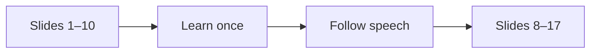

# Speech Navigation

An example deck for visual, note-aware slide control

<!-- Welcome people and explain that the deck will follow your meaning, not a spoken command. -->

---

# Three inputs

<v-clicks>

- Live presenter speech
- The rendered slide image
- Private speaker notes

</v-clicks>

<!-- Introduce the three sources. The image matters because Markdown alone misses layout and visual meaning. -->

---
layout: two-cols
---

# Text alone

Themes and components can change what an audience sees.

::right::

# Visual context

The model studies the same rendered composition.

<!-- Compare the two columns. Stress that visual context makes custom themes and components portable. -->

---

# A small window

<!-- Explain the ten-slide window and the three-slide overlap. The next window loads near the end. -->

---

# Safe by default

The API key stays in the local server.

The browser receives only the live session answer and navigation decisions.

<!-- Explain that the key is never returned to the browser and that the local endpoints reject remote computers. -->

---

# One action at a time

  ← Previous
  • Hold
  Next →

<!-- Explain that each checkpoint can move only one slide. Unclear speech holds the current slide. -->

---

# Balanced or careful

Use the default balanced mode for normal talks.

Choose careful mode when a false move would be costly.

<!-- Describe the only behavior setting. Avoid moving on until this difference is clear. -->

---

# Prefetch point

The next visual group begins loading here.

<!-- This is slide eight. Explain that prefetch starts before the first ten-slide group ends. -->

---

# Theme independence

The exporter sees fonts, colors, images, diagrams, layouts, and addon output.

<!-- Explain why export is more reliable than reading theme-specific DOM markup during a talk. -->

---

# Notes add intent

This slide looks simple.

<!-- Privately explain that this is a deliberate pause. Let the room breathe before moving on. -->

---

# Rehearse

AI can be late or wrong. Keep manual controls available for important talks.

<!-- Set honest expectations about latency, network access, cost, and model mistakes. -->

---
layout: center
speechNavigation:
  hold: true
---

# Thank you

Questions?

<!-- Final slide. Hold here while taking questions. -->
